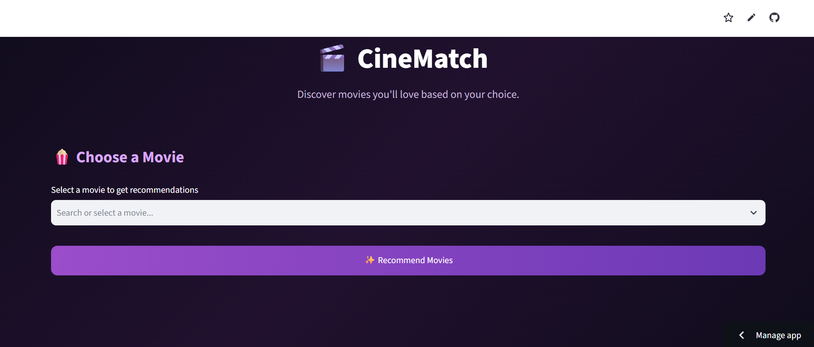
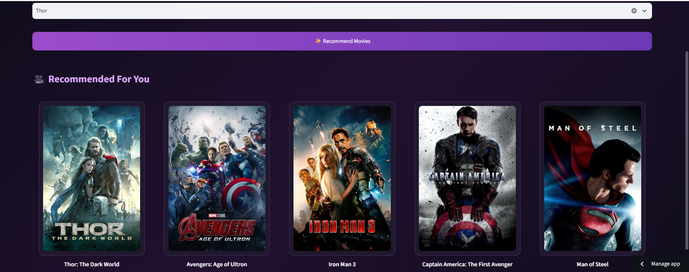
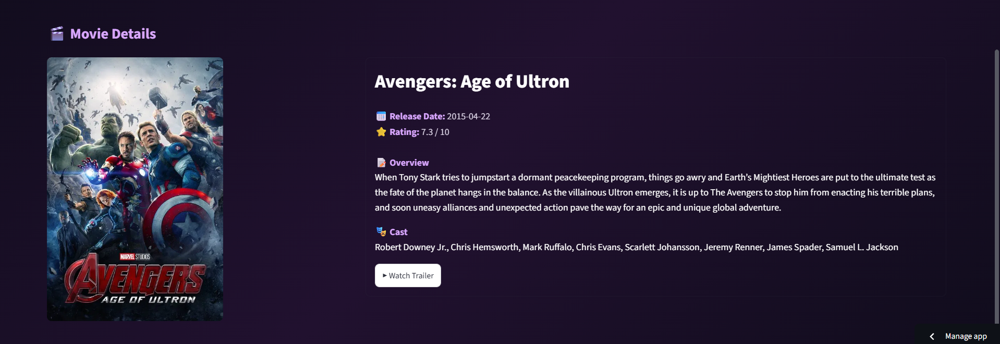

# 🎬 Movie Recommendation System

A **content-based Movie Recommendation System** built using **Python, Machine Learning, Streamlit, and the TMDB API**.

The application recommends movies similar to a movie selected by the user and provides an interactive interface where users can explore movie posters, view detailed information, and watch trailers.

## 🚀 Live Demo

**Live Application:[CineMatch — Movie Recommender](https://cinematchrecommendersystem.streamlit.app/)**  
## 📂 GitHub Repository

**GitHub:**
https://github.com/gishika190905-lab/movie_recommender_system
---
## 📌 Project Overview

Finding a movie to watch can be difficult when there are thousands of choices available.

This project solves this problem by providing a **content-based movie recommendation system**. The system analyzes movie information such as genres, keywords, cast, crew, and other textual features to determine similarity between movies.

When a user selects a movie, the application recommends the **top 5 similar movies**.

The application also integrates the **TMDB API** to provide movie posters and additional movie information.

---
## 🖥️ Application Preview

### 🏠 Home Page



### 🎬 Movie Recommendations



### 🎥 Movie Details


---
## 🎯 Objectives

- Build a movie recommendation system using Machine Learning concepts.
- Recommend movies based on their similarity to a selected movie.
- Create an interactive and user-friendly Streamlit interface.
- Fetch movie posters and details dynamically using the TMDB API.
- Allow users to explore recommended movies through clickable movie cards.
- Provide movie information such as rating, release date, genres, and overview.
- Provide a direct **Watch Trailer** option.
- Deploy the application online using Streamlit Community Cloud.

---

## ✨ Features

### 🎥 Movie Recommendations

Users can select a movie from the available movie collection and receive the **top 5 similar movie recommendations**.

### 🖼️ Movie Posters

Movie posters are dynamically fetched from the **TMDB API** using the movie ID.

### 🖱️ Interactive Movie Cards

Recommended movie posters are clickable, allowing users to open the details of a selected movie.

### 📄 Movie Details

The movie details view provides information such as:

- 🎬 Movie title
- ⭐ TMDB rating
- 📅 Release date
- 🎭 Genres
- 📝 Movie overview
- 🖼️ Movie poster

### ▶️ Watch Trailer

The application searches the TMDB video data for an available YouTube trailer and provides a **Watch Trailer** button.

### 🎨 Modern UI

The Streamlit interface uses a dark cinematic theme with:

- `#0B1020` — Background
- `#171D30` — Cards
- `#8B5CF6` — Primary purple
- `#A78BFA` — Hover purple
- `#F8FAFC` — Main text
- `#A1A1AA` — Secondary text

### ⚡ Cached API Requests

Streamlit caching is used for movie information and poster requests to reduce unnecessary API calls and improve performance.

---

## 🧠 Recommendation Approach

This project uses **content-based filtering**.

Movies are represented using textual information extracted from the dataset. These features are combined to create a representation of each movie.

A similarity matrix is then generated to measure how similar movies are to each other.

When the user selects a movie:

```text
Selected Movie
      ↓
Find Movie Index
      ↓
Retrieve Similarity Scores
      ↓
Sort Movies by Similarity
      ↓
Select Top 5 Movies
      ↓
Display Recommendations
```

The precomputed similarity matrix is stored in:

```text
similarity.pkl
```

Movie information used by the Streamlit application is stored in:

```text
movie_dict.pkl
```

---

## 📊 Dataset

The project uses the **TMDB 5000 Movie Dataset**, consisting of:

- `tmdb_5000_movies.csv`
- `tmdb_5000_credits.csv`

The datasets contain information about movies including their:

- Titles
- Genres
- Keywords
- Cast
- Crew
- Release information
- Popularity
- Ratings
- Overview

The large dataset files are managed using **Git Large File Storage (Git LFS)**.

---

## 🔄 Project Workflow

```text
             TMDB 5000 Dataset
                    │
                    ↓
             Data Preprocessing
                    │
                    ↓
             Feature Extraction
                    │
                    ↓
            Text Feature Creation
                    │
                    ↓
             Similarity Calculation
                    │
                    ↓
             similarity.pkl
                    │
                    ↓
              Streamlit App
                    │
          ┌─────────┴─────────┐
          ↓                   ↓
   Select a Movie       TMDB API
          │                   │
          ↓                   ↓
 Recommendations       Posters & Details
          │                   │
          └─────────┬─────────┘
                    ↓
             Interactive UI
                    │
                    ↓
              Movie Details
                    │
                    ↓
              Watch Trailer
```

---

## 🛠️ Technologies Used

| Technology | Purpose |
|---|---|
| Python | Programming language |
| Pandas | Data processing |
| NumPy | Numerical operations |
| Scikit-learn | Machine Learning / similarity calculation |
| Streamlit | Web application and frontend |
| Pickle | Saving trained/precomputed objects |
| Requests | TMDB API requests |
| TMDB API | Movie posters, details and trailers |
| Git | Version control |
| GitHub | Source code repository |
| Git LFS | Large file management |
| Streamlit Community Cloud | Deployment |

---

## 📂 Project Structure

```text
movie_recommender_system/
│
├── screenshots/
│   ├── home_page.png
│   ├── recommendations.png
│   └── movie_details.png
│
├── app.py                  
├── movie_dict.pkl          
├── movies.pkl              
├── similarity.pkl          
├── requirements.txt       
├── Procfile               
├── setup.sh                
├── .gitignore             
├── .gitattributes         
└── README.md             
```
---

## 🎨 Application Interface

The application provides a dark cinematic interface designed around a modern movie-platform style.

### Main Features

1. Select a movie.
2. Click **Recommend Movies**.
3. View the top 5 recommendations.
4. Click a recommended movie poster.
5. Explore movie details.
6. Click **Watch Trailer** to open the available YouTube trailer.

---

## 🔑 TMDB API Integration

The application uses the TMDB API to retrieve movie information.

The API is used for:

- Movie posters
- Movie details
- Ratings
- Release dates
- Genres
- Movie overview
- Trailer information

The TMDB API key is stored securely using Streamlit Secrets and is **not stored directly in the GitHub repository**.

For local development, the secret can be stored in:

```text
.streamlit/secrets.toml
```

Example:

```toml
TMDB_API_KEY = "your_api_key"
```

---

## 💾 Large File Management

Some project files are large and cannot be handled efficiently through normal Git tracking.

**Git LFS (Git Large File Storage)** is used for large files such as:

```text
similarity.pkl
tmdb_5000_movies.csv
tmdb_5000_credits.csv
```

This allows the project to maintain large files while keeping the Git repository manageable.

---

## 🌐 Deployment

The application is deployed using **Streamlit Community Cloud**.

The deployment workflow is:

```text
Local Project
     ↓
Git
     ↓
GitHub Repository
     ↓
Streamlit Community Cloud
     ↓
Live Web Application
```

Whenever changes are pushed to the connected GitHub repository, the deployed Streamlit application can be updated with the latest project version.

---

## ⚙️ Run Locally

### 1. Clone the repository

```bash
git clone YOUR_GITHUB_REPOSITORY_URL
```

### 2. Navigate into the project

```bash
cd movie_recommender_system
```

### 3. Create a virtual environment

```bash
python -m venv .venv
```

### 4. Activate the virtual environment

**Windows:**

```bash
.venv\Scripts\activate
```

### 5. Install dependencies

```bash
pip install -r requirements.txt
```

### 6. Configure TMDB API

Create:

```text
.streamlit/secrets.toml
```

and add:

```toml
TMDB_API_KEY = "your_api_key"
```

### 7. Run the application

```bash
python -m streamlit run app.py
```

The application will open in your browser.

---

## 🔮 Future Scope

The project can be further improved by adding:

- 🔐 User login and profiles
- ❤️ Favorites / Watchlist
- ⭐ User ratings
- 🔥 Trending movies
- 🎭 Genre-based recommendations
- 🔎 Advanced movie search
- 🎬 Multiple trailer options
- 🤖 Hybrid recommendation using collaborative filtering
- 🧠 More advanced NLP-based movie similarity
- 📱 Improved mobile responsiveness
- 🎞️ Netflix-style movie browsing interface

---

## ⚠️ Limitations

- Recommendations depend on the information available in the dataset.
- TMDB information requires an active API connection.
- Some movies may not have an available poster or trailer.
- The current recommendation approach is primarily content-based and does not learn individual user preferences.

---

## 👩‍💻 Project Author
**Ishika Gupta**
B.Tech — Artificial Intelligence & Machine Learning
Manipal University Jaipur
---

## ⭐ Acknowledgements

- **TMDB** for movie information and poster data.
- **Streamlit** for providing the framework used to build and deploy the application.
- **Scikit-learn** for Machine Learning utilities.
- **GitHub** and **Git LFS** for project version control and large-file management.
